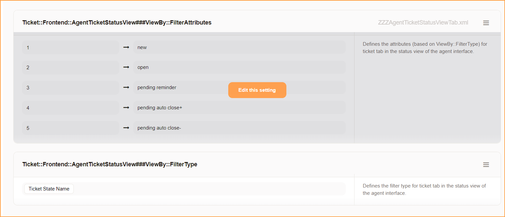
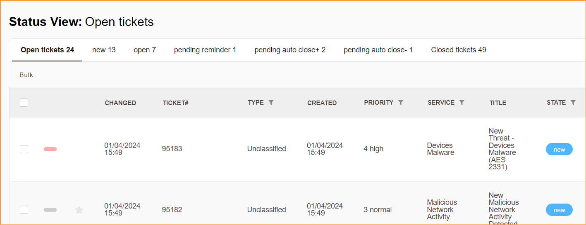

# Znuny Multiple Tab Agent Ticket Status View 
- display multiple tab of agent ticket status (opens ticket) filtered by ticket priority / ticket type / ticket state name.
- based file Znuny 7.0.16
- you may later need to update / patch it based on latest release of znuny (refer no 3).

1. Go to Admin > System Configuration > Ticket::Frontend::AgentTicketStatusView###ViewBy::FilterType

	a) Select Filter Type. Default is Ticket State Name.
	
	
2. Go to Admin >  System Configuration > Ticket::Frontend::AgentTicketStatusView###ViewBy::FilterAttributes
	
	b) Define value for the selected ViewBy::FilterType.
	
		Example 1
		=========
	
		ViewBy::FilterType => Ticket Priority
		
		ViewBy::FilterAttributes
	
			1 => 1 very low
			2 => 2 low
			3 => 3 normal
			4 => 4 high
			5 => 5 very high
		
		*where 1 = order of the field,
		*where 1 very low = ticket priority name,
		
		
		Example 2
		=========
	
		ViewBy::FilterType => Ticket Type
		
		ViewBy::FilterAttributes
	
			1 => Incident
			2 => Problem
			3 => Unclassified
		
		*where 1 = order of the field,
		*where Incident = ticket type name,

3. Additional code has been tagged with

		# ---
		# Agent Ticket Status View Tab
		# ---
		CODE CODE CODE
		# ---
		
	

