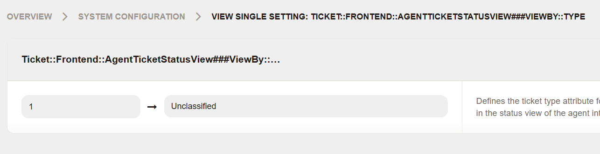
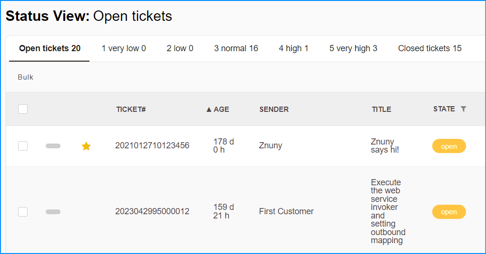

# Znuny Multiple Tab Agent Ticket Status View 
- display multiple tab of agent ticket status filtered by ticket type
- based file Znuny 7.0.9
- you may later need to update / patch it based on latest release of znuny.

1. Deploy the files to their location, set the correct permissions and deploy config.

2. Update or add the correct Ticket Type to be filter at Admin > Ticket::Frontend::AgentTicketStatusView###ViewBy::Type

	Default:
	
		1 => Unclassified
		
		*where 1 = order of the field,
		*where Unclassified = ticket type name,

